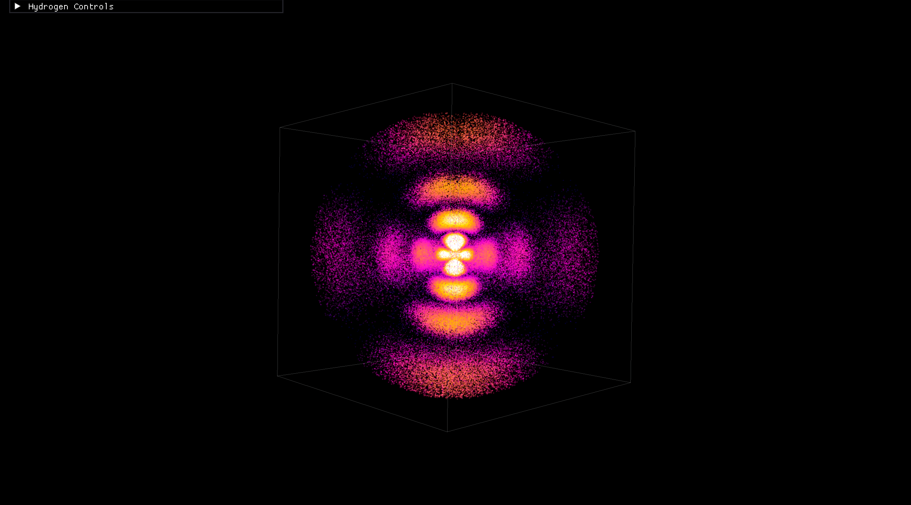
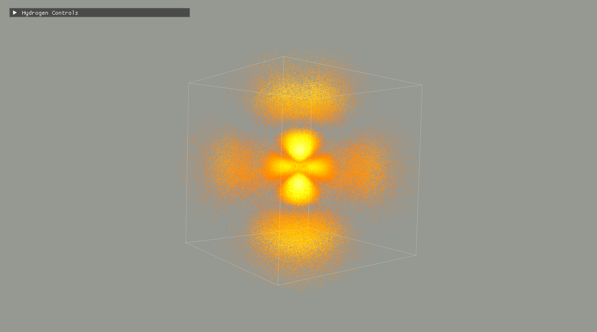
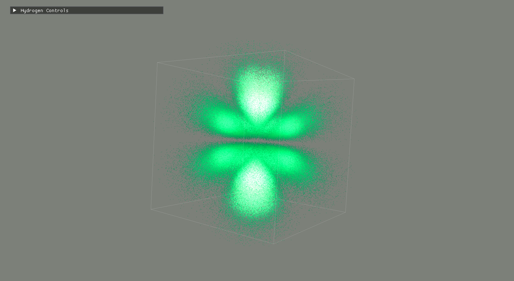
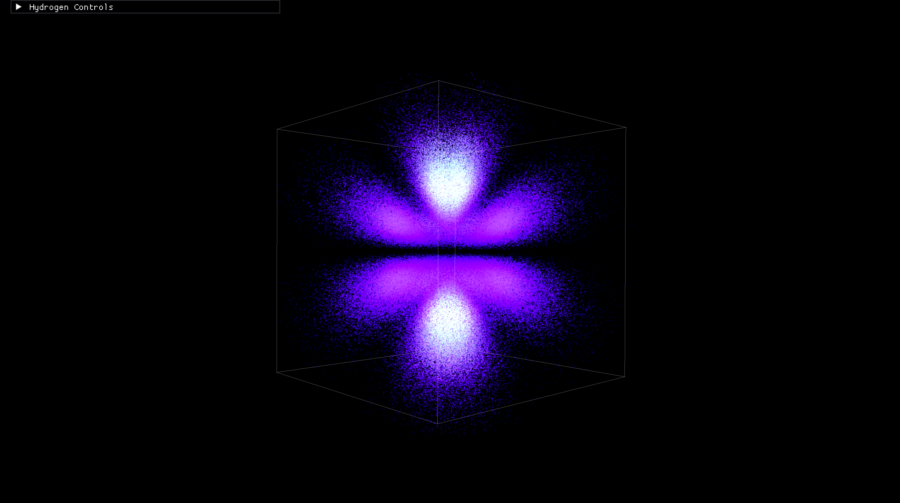

# Hydrogen Quantum Simulator

A real-time OpenGL visualization of hydrogen atom wavefunctions generated from quantum numbers and rendered as three-dimensional probability density clouds.

## Overview

This project visualizes solutions to the hydrogen Schrödinger equation using Monte Carlo sampling of the hydrogen wavefunction:

ψ(n,l,m)

The resulting probability density

|ψ|²

is rendered as a three-dimensional particle cloud using OpenGL and GLFW.

Users can interactively explore different hydrogen orbitals by changing the principal, angular momentum, and magnetic quantum numbers.

The particle renderer also includes a GPU ray-traced sphere mode adapted from
the companion CPU path tracer. Each fragment reconstructs a camera ray,
intersects it analytically with a particle sphere, shades the hit with a compact
physically inspired material model, and writes the true sphere-surface depth.
This keeps the simulator interactive at particle-cloud scale while producing
round silhouettes, stable highlights, and correct particle occlusion.

## Features

- Hydrogen orbital visualization with quantum numbers n, l, m
- Particle rendering mode
- Real-time analytic ray-traced particle spheres with per-pixel depth and material controls
- Floating-point HDR scene rendering with adjustable bright-pass bloom
- Depth-aware ambient occlusion for stronger particle clustering and shell definition
- GPU-resident probability-current animation for `m != 0` states, with no per-frame CPU particle loop or buffer upload
- Roughness-aware sphere lighting with warm key light, cool fill light, rim illumination, and hemispheric environment reflections
- Performance-tuned sphere lighting, four-tap post effects, and adjustable GPU animated-particle fraction
- Volume ray marching mode
- Flowing probability-current particle mode
- Color maps
- Slicing and clipping controls
- ImGui interface

## Controls

Use the ImGui panel to adjust quantum numbers, rendering style, volume settings, color maps, and slicing tools.

## Physics

The simulator samples electron probability density from the hydrogen atom wavefunction

ψ(n,l,m)

which is separated into radial and angular components:

ψ(r,θ,φ)=R(r)Y(θ,φ)

Accepted samples are rendered as particles, creating a three-dimensional visualization of the electron probability distribution.

## Technologies

* C++
* OpenGL
* GLFW
* GLEW
* GLM

## Future Work

* Dear ImGui interface
* Quantum number sliders
* Volume ray marching
* Isosurface rendering
* GPU-based sampling
* Additional atomic systems
* Multi-electron atoms
* Browser/WebGL version

## Build Instructions

### Requirements

This project is currently built and tested on macOS using Homebrew.

Install the required libraries:

```bash
brew install glfw glew glm
```
### macOS Build

```bash
mkdir build
cd build
cmake ..
cmake --build .
./HydrogenAtomSim
```

## Demo

### Particle Rendering Color Maps

<p align="center">
  
</p>

<p align="center">
  
  
  
</p>

<p align="center">
  <em>Gold, Viridis, and Heat Map particle-rendering presets for a 4f hydrogen orbital.</em>
</p>

## License

This project is licensed under the MIT License.

## Author

Charlie Colella

Chemistry Major | Computational Chemistry & Scientific Visualization
